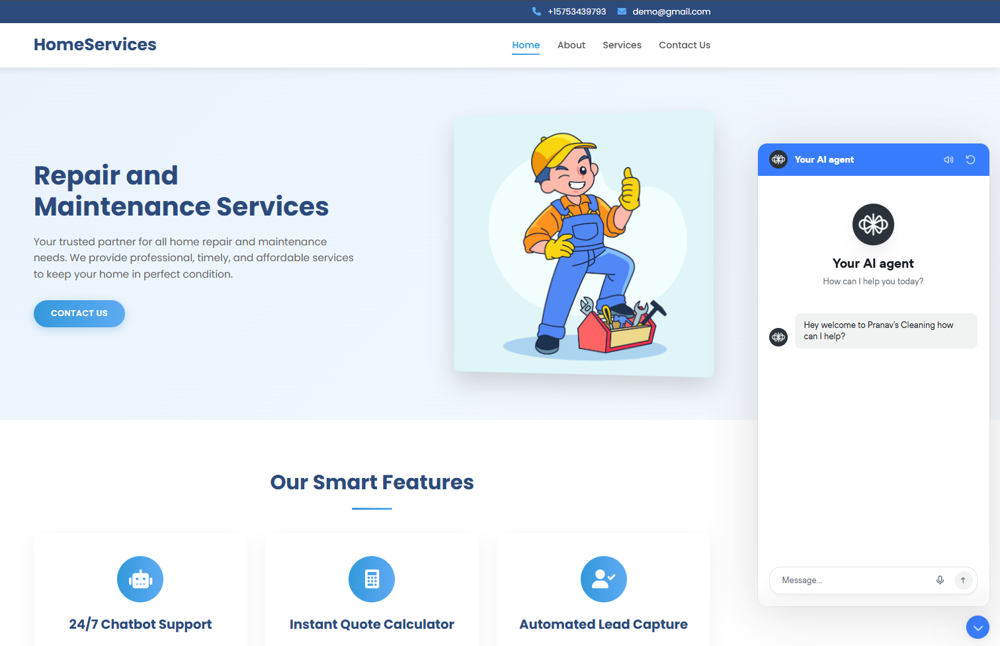
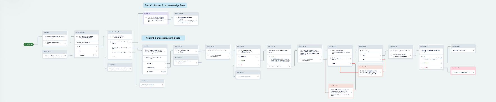
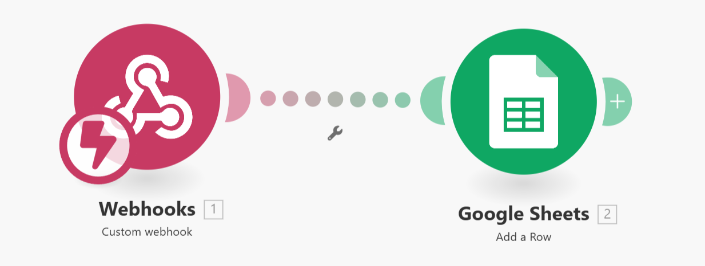

# Home Services Website

A modern, responsive landing page for a home services business offering repair and maintenance services. The website features a clean, professional design built using HTML, CSS, and minimal JavaScript with agentic AI integration.



## Table of Contents

- [Features](#features)
- [Technologies Used](#technologies-used)
- [Project Structure](#project-structure)
- [Integration Details](#integration-details)
  - [Voiceflow Chatbot](#voiceflow-chatbot)
  - [Make.com Automation](#makecom-automation)
  - [Relevance AI Integration](#relevance-ai-integration)
- [Setup Instructions](#setup-instructions)
- [Customization](#customization)
- [Performance Optimizations](#performance-optimizations)
- [Browser Compatibility](#browser-compatibility)
- [Contributing](#contributing)
- [License](#license)

## Features

- **Responsive Design**: Fully responsive layout that looks great on all devices from mobile phones to desktop computers
- **Modern UI**: Clean, professional interface with light blues, whites, and subtle gradients
- **Interactive Elements**: Form validation, mobile navigation menu, and smooth scrolling
- **Smart Integrations**: 
  - 24/7 AI Chatbot Support powered by Voiceflow
  - Automated Lead Capture via Make.com
  - Instant Quote Calculator using Relevance AI

## Technologies Used

- HTML5
- CSS3
- JavaScript (ES6+)
- Font Awesome Icons
- Google Fonts (Poppins)
- Third-party Integrations:
  - Voiceflow (Chatbot)
  - Make.com (Workflow Automation)
  - Relevance AI (Intelligent Quote System)

## Project Structure

```
├── index.html              # Homepage
├── about.html              # About Us page
├── services.html           # Services page
├── contact.html            # Contact page
├── styles.css              # Main stylesheet
├── script.js               # JavaScript functionality
└── images/                 # Image assets
    ├── make.png            # Make.com workflow diagram
    ├── schema.png          # Basic site architecture
    └── voiceflow.png       # Voiceflow chatbot workflow
```

## Integration Details

### Voiceflow Chatbot

The website features an AI-powered chatbot built with Voiceflow that provides 24/7 customer support. The chatbot is trained on a comprehensive knowledge base about home repair and maintenance services.



**Implementation Details:**
- The chatbot is integrated via a JavaScript snippet placed before the closing `</body>` tag
- Configured to provide instant responses to common service questions
- Capable of scheduling appointments and providing service estimates
- Voice-enabled for accessibility

### Make.com Automation

Lead capture and processing is automated through Make.com (formerly Integromat), creating a seamless workflow from website inquiries to your CRM system.



**Implementation Details:**
- Form submissions trigger a Make.com workflow
- Customer information is automatically added to your CRM
- Service requests are categorized and routed to appropriate departments
- Automated email confirmations are sent to customers

### Relevance AI Integration

The Instant Quote Calculator uses Relevance AI to provide accurate service estimates based on customer inputs and historical service data.

**Implementation Details:**
- API integration with Relevance AI's prediction engine
- Real-time cost estimation based on service type, property size, and other factors
- Machine learning model continuously improves quote accuracy

### Website & AI Chatbot Interface

The screenshot below shows the live website with the integrated agentic AI chatbot interface that leverages natural language processing for seamless human-computer interaction.


**Technical Implementation:**
- Contextual understanding through advanced NLP models
- Multi-modal input processing (text and voice)
- Persistent conversation state management
- Adaptive response generation based on user intent

## Setup Instructions

1. **Clone the repository**
   ```bash
   git clone https://github.com/yourusername/home-services-website.git
   cd home-services-website
   ```

2. **Configure the Voiceflow chatbot**
   - Replace the project ID in the Voiceflow script with your own Voiceflow project ID
   ```javascript
   window.voiceflow.chat.load({
     verify: { projectID: 'YOUR_PROJECT_ID' },
     // other configuration
   });
   ```

3. **Set up Make.com integration**
   - Create a webhook in Make.com and update the form action in contact.html
   - Configure the data mapping in your Make.com scenario

4. **Customize content**
   - Update the service descriptions, contact information, and about us content
   - Replace images with your own branding and team photos

5. **Deploy the website**
   - Upload all files to your web hosting provider
   - Ensure all relative links work correctly

## Customization

### Colors and Branding

The main color scheme can be modified in the `styles.css` file:

```css
:root {
  --primary-color: #3498db;
  --primary-light: #5dabf3;
  --secondary-color: #2c4b7c;
  --text-color: #333;
  --light-bg: #f8f9fa;
}
```

### Adding New Services

To add a new service to the services page:

1. Open `services.html`
2. Duplicate an existing service card within the `.services-grid` section
3. Update the icon, title, description, and features list

## Performance Optimizations

- Images are optimized for web delivery
- CSS is structured to minimize redundancy
- JavaScript is kept minimal and non-blocking
- Third-party resources are loaded asynchronously

## Browser Compatibility

- Chrome (latest)
- Firefox (latest)
- Safari (latest)
- Edge (latest)
- IE11 (basic functionality)

## Contributing

1. Fork the repository
2. Create your feature branch (`git checkout -b feature/amazing-feature`)
3. Commit your changes (`git commit -m 'Add some amazing feature'`)
4. Push to the branch (`git push origin feature/amazing-feature`)
5. Open a Pull Request

## License

Distributed under the MIT License. See `LICENSE` for more information.

---

© 2025 HomeServices. All Rights Reserved.